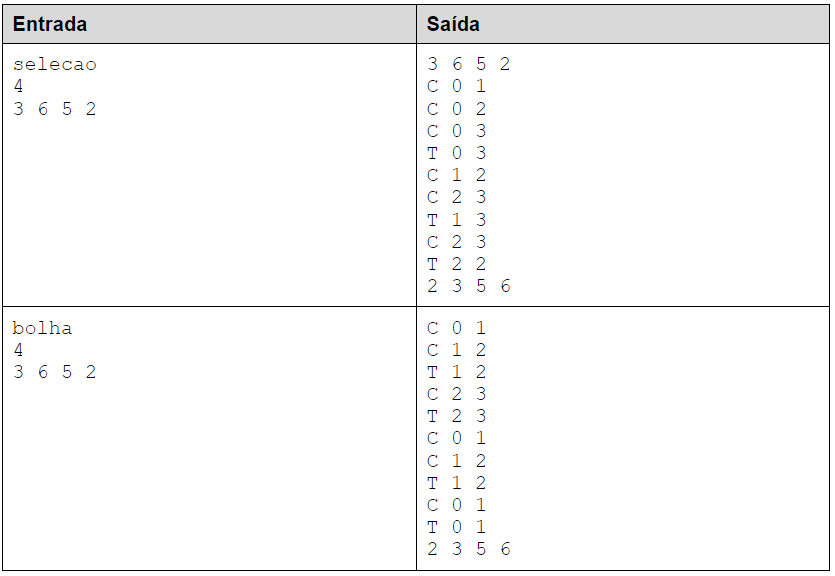

Descrição da atividade: 

Atividade:

Faça um programa em C que receba o nome do método de ordenação (no caso, selecao ou bolha), o número N de elementos de um vetor. Após isso, leia os N elementos e imprima as indicações de todas as comparações e trocas realizadas pelo método escolhido, seguido do vetor ordenado.

As comparações e trocas devem ser impressas de acordo com os índices dos elementos envolvidos na operação. Por exemplo, se o elemento do índice 3 foi comparado com o elemento do índice 7, então deve-se imprimir C 3 7. Se o elemento de índice 2 foi trocado com o elemento de índice 5, deve-se imprimir T 2 5.

